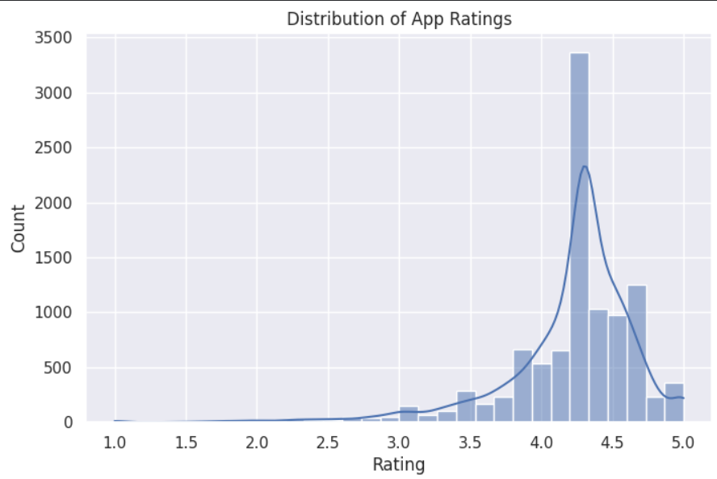
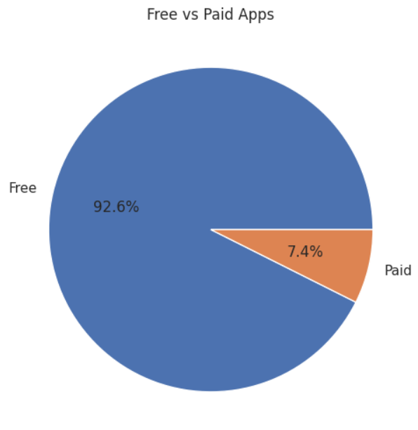
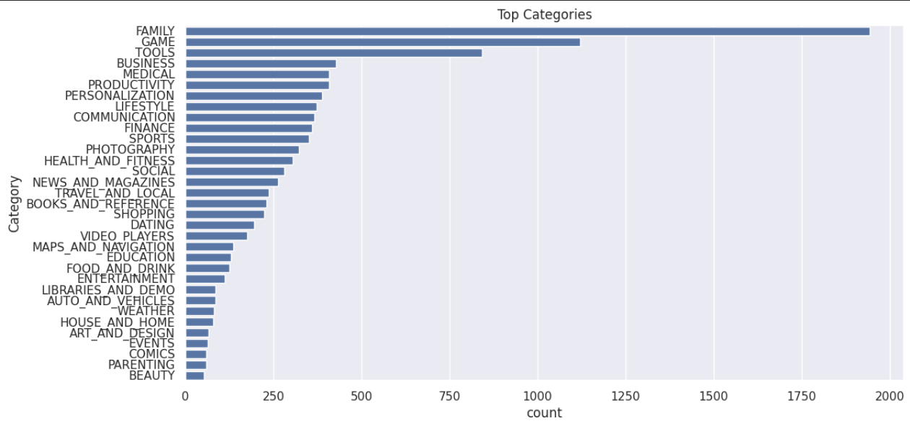
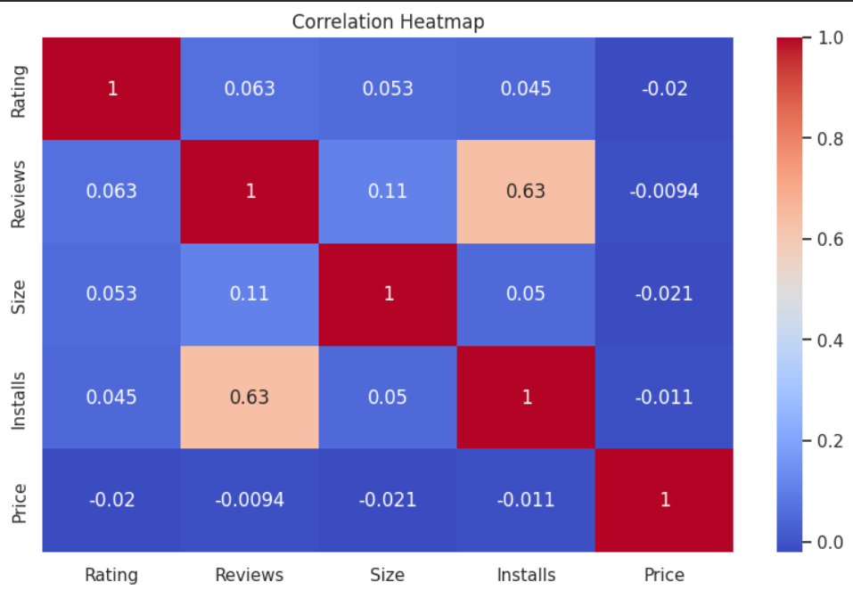
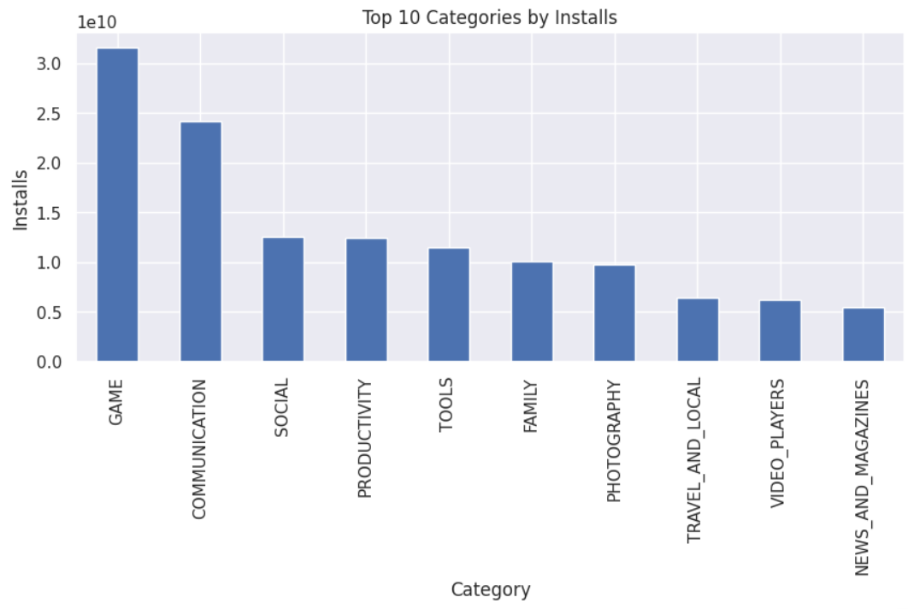

# 📊 PRODIGY_DS_02 – Google Play Store Apps EDA

## 📌 Task Overview

This project is completed as part of my **Data Science Internship at Prodigy InfoTech**.

The objective of this task is to perform **Data Cleaning** and **Exploratory Data Analysis (EDA)** on the **Google Play Store Apps** dataset to uncover meaningful insights, identify patterns, and explore relationships between different app attributes.

---

## 🎯 Objective

- Clean and preprocess the dataset.
- Handle missing values and inconsistent data.
- Explore app ratings, categories, installs, pricing, and reviews.
- Visualize trends and relationships using different plots.
- Summarize key insights from the analysis.

---

## 📂 Dataset

- **Dataset:** Google Play Store Apps
- **Source:** Kaggle
- **Link:** https://www.kaggle.com/datasets/lava18/google-play-store-apps

---

## 🧹 Data Cleaning

The following preprocessing steps were performed before analysis:

- Removed duplicate records.
- Converted data types to appropriate formats.
- Cleaned numeric columns such as Reviews, Installs, Size, and Price.
- Converted the Last Updated column to datetime format.
- Handled missing values.
- Removed invalid rating values (ratings outside the valid range of 1–5).

---

## 📊 Exploratory Data Analysis (EDA)

The following visualizations were created:

1. Distribution of App Ratings
2. Free vs Paid Apps
3. Top App Categories
4. Rating Distribution by Category
5. App Size Distribution
6. Installs Distribution
7. Reviews vs Rating
8. Paid Apps Price Distribution
9. Correlation Heatmap
10. Top 10  Most Categories by Installs
11. Top 10 Most Reviewed Apps
12. Average Rating by Content Rating
13. Distribution of Free and Paid Apps Across Categories

---

## 📸 Sample Visualizations

### Rating Distribution



---

### Free vs Paid Apps



---

### Top Categories



---

### Correlation Heatmap



---

### Top Categories by Installs



---

## 📈 Key Insights

- Around **92.6%** of applications on the Play Store are free.
- Most apps have ratings between **4.0 and 4.5**, indicating generally positive user feedback.
- **Family**, **Game**, and **Tools** contain the highest number of applications.
- **Game** and **Communication** categories record the highest number of installs.
- Most paid applications are priced below **$20**.
- Reviews and installs show a moderate positive correlation, suggesting that popular apps receive more user engagement.

---

## 🛠️ Technologies Used

- Python
- Pandas
- NumPy
- Matplotlib
- Seaborn
- Google Colab
- Jupyter Notebook

---

## 📁 Repository Structure

```
PRODIGY_DS_02
│
├── data/
│   └── googleplaystore.csv
│
├── notebook/
│   └── PRODIGY_DS_02.ipynb
│
├── images/
│   ├── rating_distribution.png
│   ├── free_vs_paid_apps.png
│   ├── top_categories.png
│   ├── correlation_heatmap.png
│   └── top_10_categories_by_installs.png
│
├── README.md
└── .gitignore
```

---

## 🎓 Internship

**Prodigy InfoTech – Data Science Internship**

**Task-02:** Data Cleaning and Exploratory Data Analysis (EDA)

---

### ⭐ If you found this project helpful, consider giving it a star!
